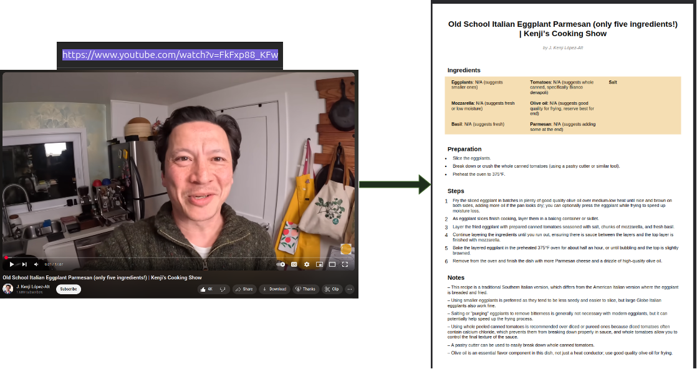

# youtube-recipe-generator

This is a personal project of mine which takes a url of a youtube recipe video, and generates an output pdf of the recipe using the video transcript. The transcript is summarised by an LLM (Gemini), the output is then parsed and formatted in the respective sections in the pdf.

The transcript surprisingly often doesn't contain measurements for ingredients (usually they are displayed on screen or as a viewer you can infer from the video). Therefore there's additional functionality to save out the data in json format, make manual changes and render to pdf from the changes.




## Usage

There's a simple command line input:

```
python create_recipe.py \
        --url="https://www.youtube.com/watch?v=VIdlVi-VzPY" \
        --output_dir="recipes/"
```

Which generates the recipe pdf with the youtube title in the output directory. 

You can add a `--verbose` flag to see outputs, such as number of tokens used:

```
python create_recipe.py \
        --url="https://www.youtube.com/watch?v=VIdlVi-VzPY" \
        --output_dir="recipes/" \
        --verbose
```

### Making Manual changes to the PDF

Since PDFs are not easy to edit and the recipe will often have missing ingredients, there is functionality to load and save the data extracted as `.json`, where you can make manual changes.

To do so, simply add a `--save_sections_file` flag input to the arguments:

```
python create_recipe.py \
        --url="https://www.youtube.com/watch?v=VIdlVi-VzPY" \
        --output_dir="recipes/" \
        --save_sections_file
```

This will save the `sections.json` in the output directory, where you can make manual changes.
To render this as pdf, simply call the function, providing an input path to the `sections.json`

```
python create_recipe.py \
        --output_dir="recipes/"
        --section_file="recipes/sections/sections.json" 
```


## Setting up the environment


### 1. Installing the environment

Requirements: `python 3.10` (with `python-venv` installed).
It probably works on other versions of python but I haven't tested it.

On Linux:

```
python3.10 -m venv .venv
source .venv/bin/activate
python -m pip install -r requirements.txt
```

On Windows (command prompt):
```
python -m venv .venv
.venv\Scripts\activate.bat
python -m pip install -r requirements.txt
```

### 2. Generating a Gemini API Key

This uses Gemini to parse the transcript of the video. Therefore a Gemini API key is needed. You can generate one really easily [here](https://aistudio.google.com/welcome?utm_source=google&utm_medium=cpc&utm_campaign=FY25-global-DR-gsem-BKWS-1710442&utm_content=text-ad-none-any-DEV_c-CRE_726176697272-ADGP_Hybrid%20%7C%20BKWS%20-%20EXA%20%7C%20Txt-Gemini-Gemini%20API%20Key-KWID_43700081667369045-kwd-2337564139625&utm_term=KW_gemini%20api%20key-ST_gemini%20api%20key&gclsrc=aw.ds&gad_source=1&gad_campaignid=21345648142&gclid=Cj0KCQjwrPHABhCIARIsAFW2XBPBglORV-CyA9OTE0Pmt5Qw3x2QLEpX72Fi0hSp-UbSFYa86O4Um40aAn3WEALw_wcB), which is free with daily usage limits. 

Once you have the API key, create a `.env` file in the repo root directory, and add your key with the line:

```
GEMINI_API_KEY="XXXXXXXXXXXXXXXXXXXXXXXX"
```


And that's it! All is set up for use now.

## Future Features

Small improvements to add:

- Add video portion generation. Example: generate recipe from only between timestamps 2:30 and 5:00 of the input video. 

New features: 
- Add transcript generation - if a transcript doesn't exist on the video, generate one with a transcription model.